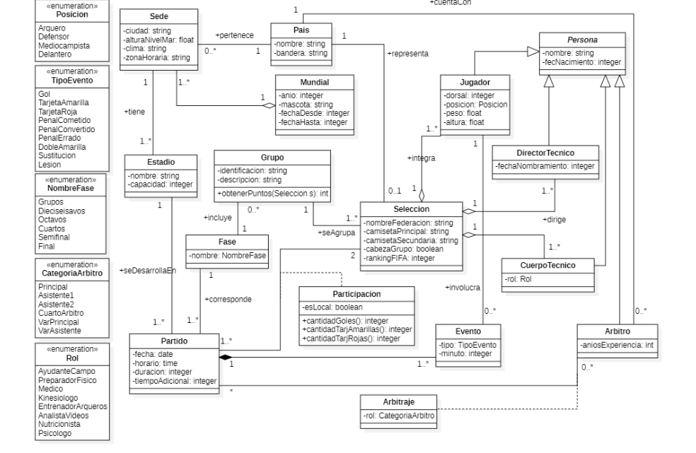

# Taller integrador de Programacion ll

## Integrantes

**Murgan, Juan Francisco**

**Leon, Liset**

## Descripcion

En este repositorio iremos realizando el desarrollo del taller integrador dado por la catedra, donde progresivamente iremos actualizando y subiendo los cambios al respecto.

### Sistema a implementar

La idea del proyecto es implementar el siguiente esquema en UML a un programa funcional en el lenguaje orientado a objetos Java.

